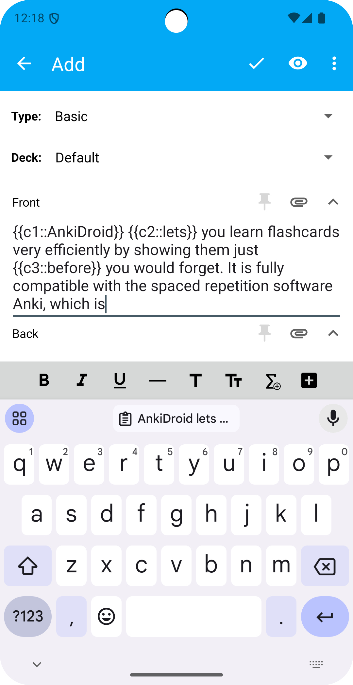
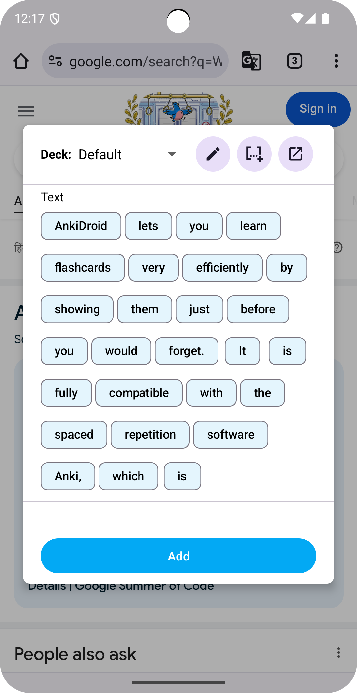
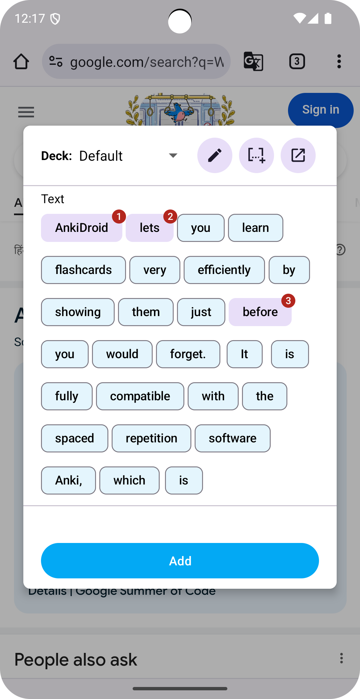
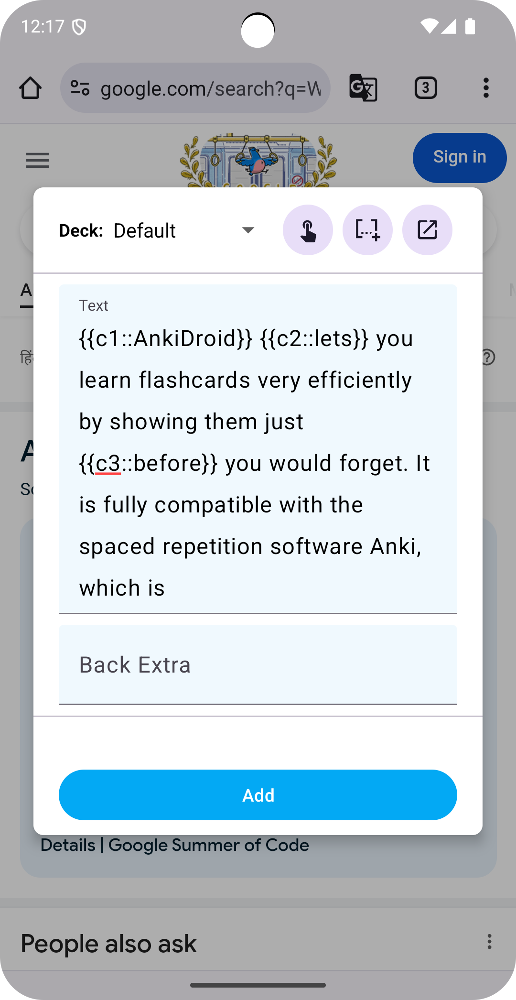
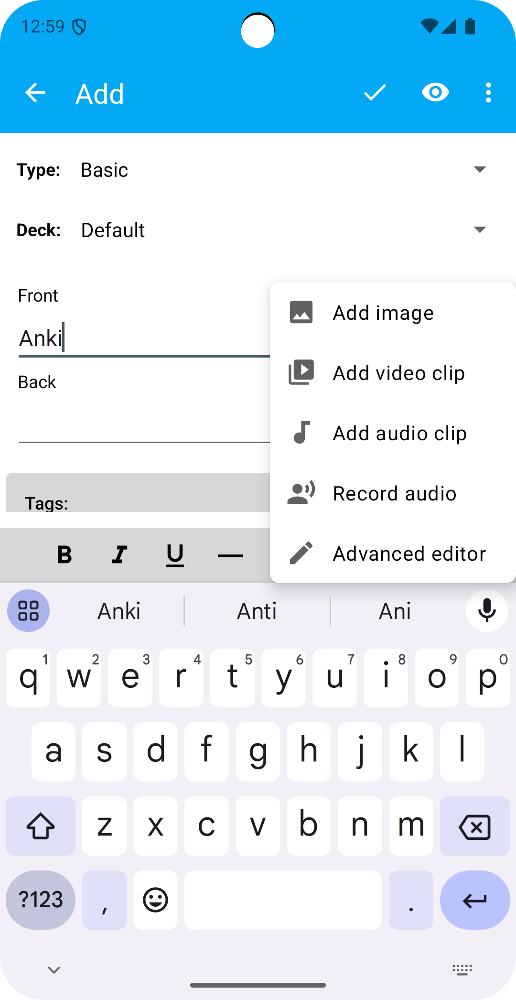
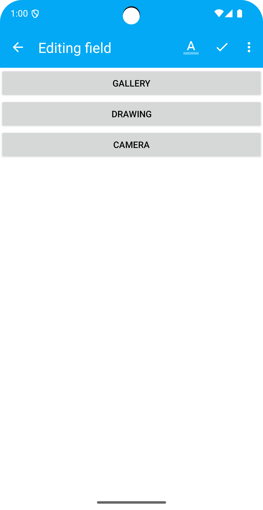
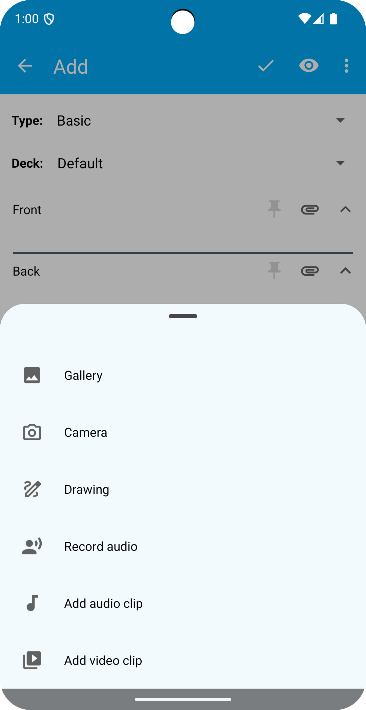
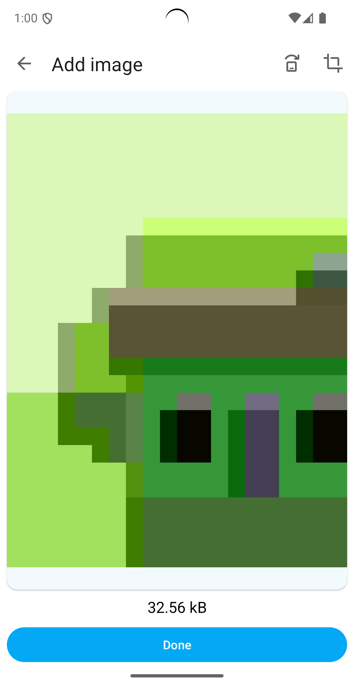

<h1 align="center">criticalAY - Ashish Yadav 2024   
  <a href="[AnkiDroid](https://github.com/ankidroid/Anki-Android)">AnkiDroid</a> </h1>

## Catch me up
| Handles | User Name |
| --- | --- |
| **Github** | [criticalAY](http://github.com/criticalAY) |
| **Twitter**  | [criticalAY_](https://x.com/criticalAY_) |
| **LinkedIn**  | [criticalAY](https://www.linkedin.com/in/criticalay/) |

## My mentors
| Name | Profile |
| --- | --- |
| **David Allison** | [Github](https://github.com/david-allison) |
| **Shridhar Goel**  | [LinkedIn](https://www.linkedin.com/in/shridhargoel/_) |

## Project summary

[AnkiDroid](https://github.com/ankidroid/Anki-Android) is a companion Android application for [Anki](https://github.com/ankitects/anki), a 
flashcards application that helps people learn and memorize a diverse variety of topics. 

[Instant Add Note Editor & Multimedia UI/UX](https://summerofcode.withgoogle.com/programs/2024/projects/HHr5HsjN) consisted of
improvising the process of adding cloze notes in the AnkiDroid app and multimedia UI/UX improvements and at the same time decoupling the 
multimedia code in the codebase.

## What did I do?

### Community Bonding Period
It is the initial time that Google gives to be involved in the community activities that happen within an organization. 
Since I already had been contributing and knew the community it went very well, even though I started my coding in this 
period so that I could compensate for the time that I wouldn't be active due to my university exams, it was fun.

### Coding period
 - Week 1: Here I spent my time setting up the project and the necessary files required for the project like designs, icons, and other resources. Then started with setting up the Intent filters, text intents, etc
Created a rough layout for the instant editor dialog and shared it in the public channel and discord for discussion 
- Week 2: I started working on the code and created a PR/s(pull request) so that the mentors can review it and give feedback.
  * Extracted the `ActionMode.Callback` mechanism which is used to control the context menu shown when we long press certain text in the app.
  * UI improvements in the instant note editor dialog such as edit text fields, error/warning text, etc.
  * Long press select multiple words and turn them to cloze using the extracted `ActionMode.Callback`.
- Week 3: Continued to work on the Instant Note Editor code.
  * Created an extension method for cloze fields, and resolved bugs.
  * Utilised backend error check methods while saving the note and display the correct error/warning.
  * We decided to migrate the business logic to a `ViewModel`.
- Week 4: Worked on the open PR handling the suggestions and feedback received from the mentors
  * First we used `EditText` and `Chip` drawables inside it to display the words from a sentence but we soon realized the limitation of this approach hence after a detailed discussion we shifted to the `ChipGroup` layout.
  * Updated working logic for the cloze field and hence separating the single tap mode and advanced edit text mode. 
- Week 5: PR suggestion resolving and deciding the course of action for the future work, also had my university exams so I stuck to the open PRs and continued to improvise them.
- Week 6: Created a PR to improvise the Instant Editor business logic and started setting up the Multimedia Editor.
  * Cloze number logic improvements such as the cloze patterns bug fixes and dialog discard logic setup for the Instant Note Editor
  * Setting up Multimedia activity for the second sub-project
- Week 7: Continued to work on the open Instant Note Editor PR and created a new PR for multimedia editor and set it to dev only in the project.
  * Continued to fix the Instant Note Editor bugs.
  * Multimedia UI editor for camera and gallery option.
- Week 8: Wrapped up Instant Note Editor and continued to work on Multimedia UI/UX.
  * Got Instant Note Editor ready for public use which will be released in a controlled manner i.e. alpha -> beta -> stable.
  * Set up Audio and Video clip options in Multimedia and created a PR.
- Week 9: Continued to work on the Multimedia UI/UX.
  * Resolved suggestions on the open Multimedia UI/UX PR.
  * Created PR for Audio Recording and Drawing options
- Week 10: Wrapping up Multimedia UI/UX
  * Resolved the suggestions and marked the Multimedia UI/UX ready for public use.

## Link to pull requests created as a part of GSoC by chronological order
 1. [Instant Note Editor to allow adding cloze card](https://github.com/ankidroid/Anki-Android/pull/16393)
 2. [Extract ActionMode.Callback from NoteEditor](https://github.com/ankidroid/Anki-Android/pull/16401)
 3. [Extension method to get cloze field name](https://github.com/ankidroid/Anki-Android/pull/16424)
 4. [Ese field check from backend and display error accordingly](https://github.com/ankidroid/Anki-Android/pull/16432)
 5. [Init: Instant Note Editor Activity](https://github.com/ankidroid/Anki-Android/pull/16497)
 6. [Enhancements: Instant Note Editor Improvements](https://github.com/ankidroid/Anki-Android/pull/16534)
 7. [New Multimedia UI](https://github.com/ankidroid/Anki-Android/pull/16673)
 8. [Enhancement: add long press listener on cloze button ](https://github.com/ankidroid/Anki-Android/pull/16735)
 9. [Refactor: cloze builder pattern for words](https://github.com/ankidroid/Anki-Android/pull/16736)
 10. [Refactor: use prefill value in integer dialog](https://github.com/ankidroid/Anki-Android/pull/16745)
 11. [Enable instant editor for public use](https://github.com/ankidroid/Anki-Android/pull/16760)
 12. [Enhacement: add Audio and Video multimedia options](https://github.com/ankidroid/Anki-Android/pull/16769)
 13. [Fix: cloze number incorrect on undo](https://github.com/ankidroid/Anki-Android/pull/16779)
 14. [Refactor: Multimedia options converted to sealed class](https://github.com/ankidroid/Anki-Android/pull/16796) *Closed after discussion*
 15. [Multimedia UI/UX: Add Drawing & Recording options and set multimedia public](https://github.com/ankidroid/Anki-Android/pull/16798)
 16. [Refactor: vibration methods to use Duration](https://github.com/ankidroid/Anki-Android/pull/16803)
 17. [Refactor: move audio package to multimedia package ](https://github.com/ankidroid/Anki-Android/pull/16816)

## Results

Before Instant Note Editor

  User had to copy and past the text in app and then create a cloze note or share the copied text to AnkiDroid will
  opened the NoteEditor Screen: 
 

    

After Instant Note Editor

 User can select, and share selected text to AnkiDroid `Instant Note` will help them to create cloze notes without actually opening the app:
  

    

    

Old Multimedia UI

 

    
    

New Multimedia

 

    
    

## Plans after GSoC?
Having successfully fulfilled all the commitments outlined in my GSoC proposal, my focus now shifts towards further enhancing the quality and robustness of the codebase. One critical area that I plan to address is the creation of comprehensive test suites, including both Unit Tests and Android Tests. These tests are essential for ensuring the reliability and stability of the application, and I intend to develop them as part of my ongoing contributions to the project.

My journey with AnkiDroid does not end with the conclusion of GSoC. I am committed to continuing my involvement with the project, and leveraging the experience and knowledge I have gained to make meaningful contributions. By staying actively engaged with the AnkiDroid community, I aim to help maintain and improve the app, ensuring it continues to be a valuable tool for users worldwide.

