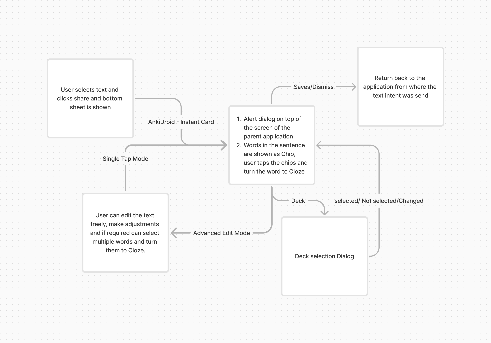
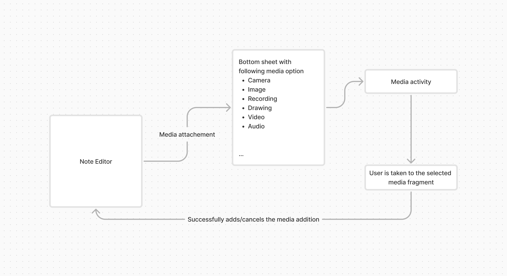

<h1 align="center">criticalAY - Ashish Yadav 2024   
  <a href="[AnkiDroid](https://github.com/ankidroid/Anki-Android)">AnkiDroid</a> </h1>

## Catch me up on
[Github](http://github.com/criticalAY) | [Twitter](https://x.com/criticalAY_) | [LinkedIn](https://www.linkedin.com/in/criticalay/)

## My mentors
[David Allison](https://github.com/david-allison) | [Shridhar Goel](https://www.linkedin.com/in/shridhargoel/_) 

## Project summary

[AnkiDroid](https://github.com/ankidroid/Anki-Android) is a companion Android application for [Anki](https://github.com/ankitects/anki), a 
flashcards application that helps people learn and memorize a diverse variety of topics. 

[Instant Add Note Editor & Multimedia UI/UX](https://summerofcode.withgoogle.com/programs/2024/projects/HHr5HsjN) consisted of
* Streamlining the process of adding [cloze notes](https://docs.ankiweb.net/editing.html#cloze-deletion) to AnkiDroid
* Improving the app's UI & UX for adding multimdedia [Images/Drawing/Camera/Audio Recordings/Inserting files]
* Decoupling the app's multimedia handling

## Results

### Before Instant Note Editor
The user had to copy and paste the text in the app and then create a cloze note or share the copied text to AnkiDroid, which would open the NoteEditor Screen: 

    

### After Instant Note Editor
Users can select and share selected text to AnkiDroid. The `Instant Note` feature helps them create cloze notes without actually opening the app:

       
    
    

### Old Multimedia UI

    
    

### New Multimedia UI

    
    

## Working

### Instant Note Editor

    

### Multimedia UI/UX

    

## How did I do it?

### Community Bonding Period
Community Bonding is the initial time that Google gives to be involved in the community and activities that happen within an organization. Since the community was small and I already had been contributing and knew the community, it went very well. I enjoyed it and started my coding during this period so that I could compensate for the time that I wouldn't be active due to my university exams.

### Instant Note Editor
In the first phase of the GSoC project, the focus was on developing the Instant Note Editor. The journey began with setting up the project's foundational elements, such as design resources and intent filters, followed by the creation of a preliminary layout for the editor dialog. Over the following weeks, the project progressed rapidly, with significant enhancements to the user interface and functionality. Key achievements included implementing ActionMode.Callback for improved context menu handling, refining error validation, and migrating business logic to ViewModel for better state management. The transition from using EditText and Chip drawables to ChipGroups marked a crucial improvement in the user interface, addressing initial limitations. The project culminated in the finalization of the Instant Note Editor, which was prepared for a controlled release cycle, ensuring a polished and user-friendly experience for its public rollout.

### Multimedia UI/UX
The second phase of the project centered around the development of the Multimedia UI/UX, aiming to enrich the note-taking experience by integrating multimedia elements. The setup of the Multimedia activity marked the beginning of this phase, laying the groundwork for subsequent features. Over the weeks, the multimedia editor evolved to include options for camera and gallery integration, enabling users to seamlessly add images to their notes. The development was methodical, with features being tested and refined in a developer-only environment to ensure stability. As the project neared completion, additional multimedia options like audio recording and drawing were incorporated, further enhancing the user experience. The project was wrapped up with the Multimedia UI/UX being marked ready for public use, ensuring a robust and dynamic addition to the note editor.

## Link to pull requests created as a part of GSoC by chronological order
 1. [Instant Note Editor to allow adding cloze card](https://github.com/ankidroid/Anki-Android/pull/16393)
 2. [Extract ActionMode.Callback from NoteEditor](https://github.com/ankidroid/Anki-Android/pull/16401)
 3. [Extension method to get cloze field name](https://github.com/ankidroid/Anki-Android/pull/16424)
 4. [Ese field check from backend and display error accordingly](https://github.com/ankidroid/Anki-Android/pull/16432)
 5. [Init: Instant Note Editor Activity](https://github.com/ankidroid/Anki-Android/pull/16497)
 6. [Enhancements: Instant Note Editor Improvements](https://github.com/ankidroid/Anki-Android/pull/16534)
 7. [New Multimedia UI](https://github.com/ankidroid/Anki-Android/pull/16673)
 8. [Enhancement: add long press listener on cloze button ](https://github.com/ankidroid/Anki-Android/pull/16735)
 9. [Refactor: cloze builder pattern for words](https://github.com/ankidroid/Anki-Android/pull/16736)
 10. [Refactor: use prefill value in integer dialog](https://github.com/ankidroid/Anki-Android/pull/16745)
 11. [Enable instant editor for public use](https://github.com/ankidroid/Anki-Android/pull/16760)
 12. [Enhacement: add Audio and Video multimedia options](https://github.com/ankidroid/Anki-Android/pull/16769)
 13. [Fix: cloze number incorrect on undo](https://github.com/ankidroid/Anki-Android/pull/16779)
 14. [Refactor: Multimedia options converted to sealed class](https://github.com/ankidroid/Anki-Android/pull/16796) *Closed after discussion*
 15. [Multimedia UI/UX: Add Drawing & Recording options and set multimedia public](https://github.com/ankidroid/Anki-Android/pull/16798)
 16. [Refactor: vibration methods to use Duration](https://github.com/ankidroid/Anki-Android/pull/16803)
 17. [Refactor: move audio package to multimedia package ](https://github.com/ankidroid/Anki-Android/pull/16816)

## Plans after GSoC?
Having successfully fulfilled all the commitments outlined in my GSoC proposal, my focus now shifts towards further enhancing the quality and robustness of the codebase. One critical area that I plan to address is the creation of comprehensive test suites, including both Unit Tests and Android Tests. These tests are essential for ensuring the reliability and stability of the application, and I intend to develop them as part of my ongoing contributions to the project.

My journey with AnkiDroid does not end with the conclusion of GSoC. I am committed to continuing my involvement with the project, and leveraging the experience and knowledge I have gained to make meaningful contributions. By staying actively engaged with the AnkiDroid community, I aim to help maintain and improve the app, ensuring it continues to be a valuable tool for users worldwide.

